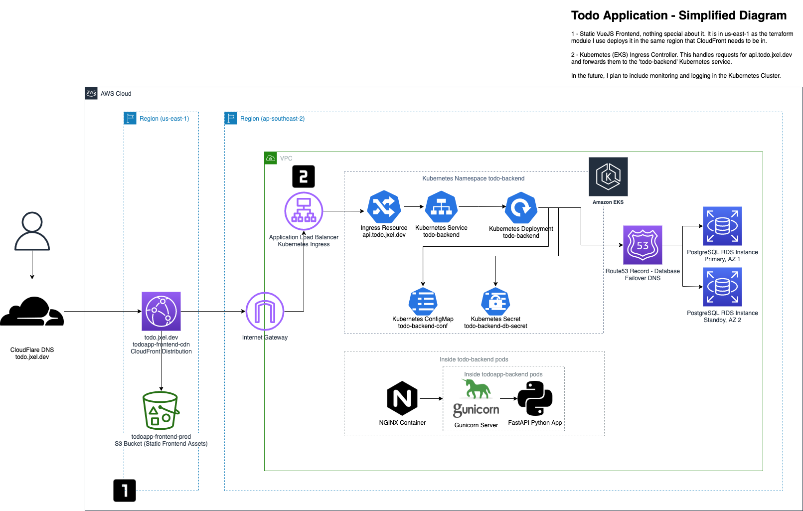

# todo-backend

"Todo list" Rest API written in python with user login support. See https://github.com/jxeldotdev/todo-frontend

## Infrastructure overview


## Usage

```shell
docker-compose up -d db
docker-compose pull
docker-compose run --rm app migrate
docker-compose up -d app
```

## Updating migrations
```shell
docker-compose run --rm --entrypoint sh app alembic revision --autogenerate -m "migration-name-here :)"
```

## Updating dependencies
Update requirements.txt to match pipenv by running the following:
```shell
pipenv run pip freeze > requirements.txt
```

## Contributing

Unfortunately for this repository pull requests will not be merged into this project as it is a personal showcase.


## Functionality / project checklist

- [X] Create a Helm chart for the application

- [X] Create a seperate repo with Terraform configuration for EKS infrastructure

- [ ] Automate deployment of application

- [ ] Add monitoring to app with Prometheus
