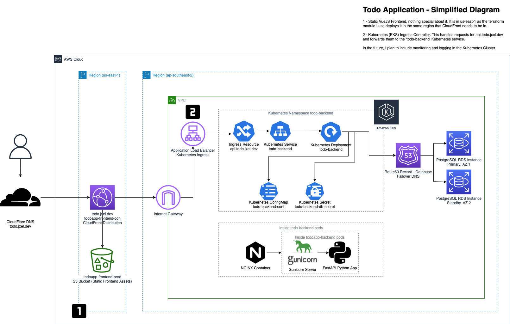
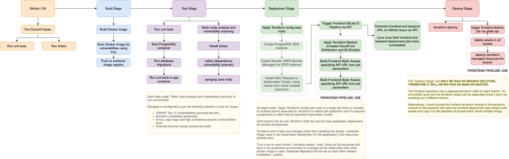

# infra

Kubernetes related infrastructure and manifests for the application and it's basic configuration.
Currently only tested on Minikube.

Excluding `app`, this needs to be moved to another repository.
A helm chart should be created for the application manifests.

`nginx.conf.template` is used in docker - the nginx conf in the configmap is slightly difference as since nginx and the api are in the same pod in k8s `localhost` can be used, but the name of the container must be used with docker-compose.

## Infrastructure Diagram

## CI/CD Pipeline Diagram (desired)

